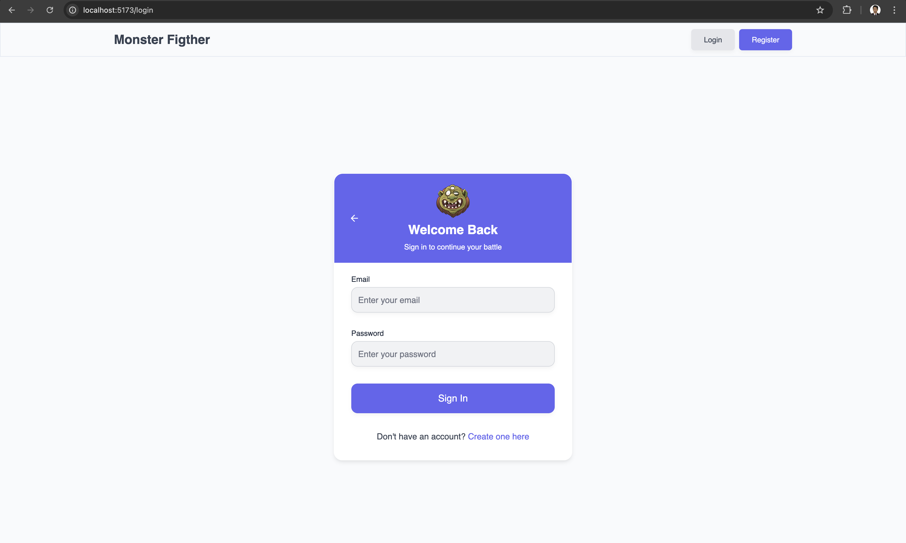
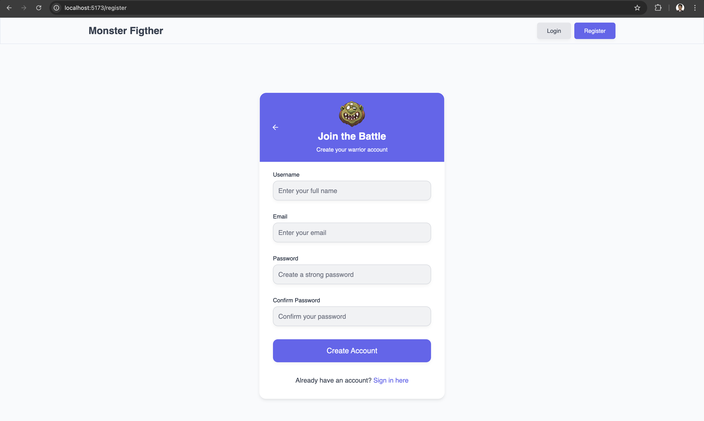
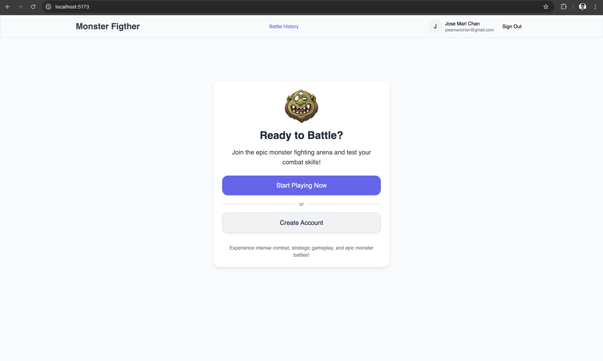
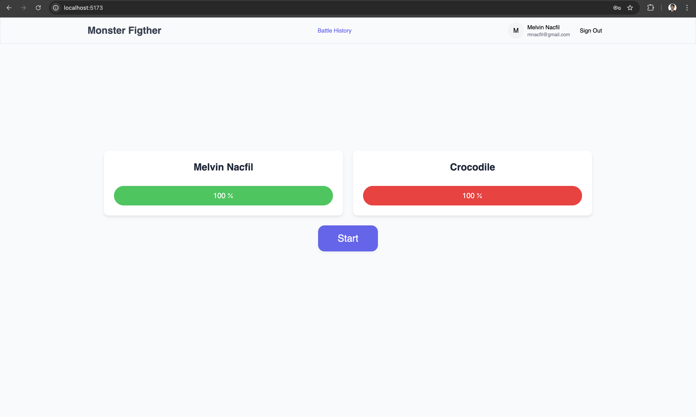
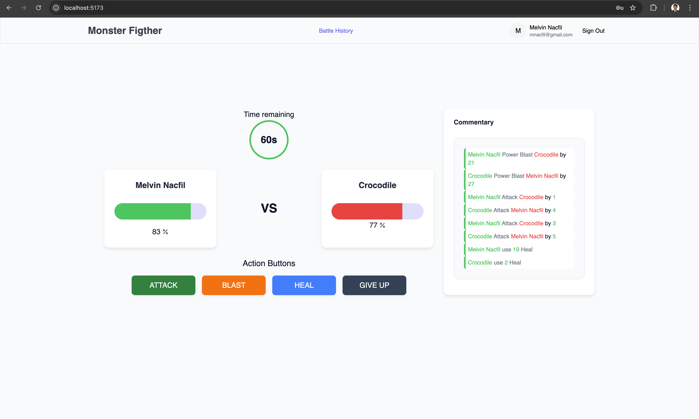
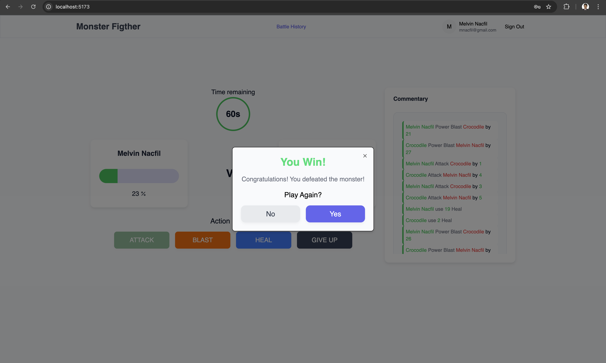
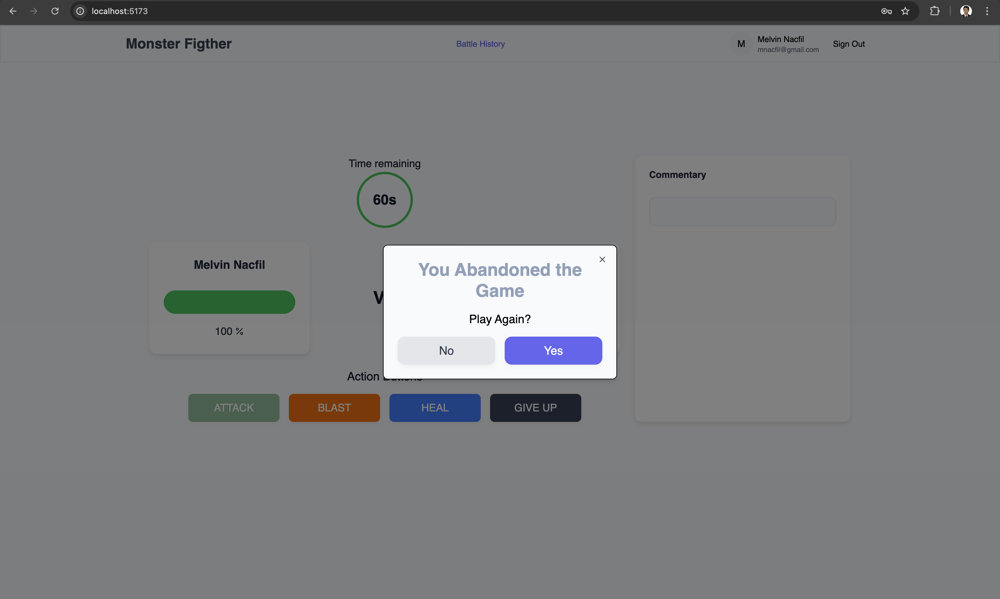

# GEVME Assessment - MERN Stack Application

A full-stack web application built with the MERN stack (MongoDB, Express.js, React, Node.js) using modern development tools and practices.

## 🚀 Tech Stack

### Frontend (Client)

- **React** - UI library
- **Vite** - Build tool and development server
- **TypeScript** - Type safety
- **Tailwind CSS** - Utility-first CSS framework
- **shadcn/ui** - UI component library
- **React Router** - Client-side routing
- **Axios** - HTTP client

### Backend (Server)

- **Node.js** - Runtime environment
- **Express.js** - Web framework
- **MongoDB** - NoSQL database
- **Mongoose** - MongoDB ODM
- **JWT** - Authentication

## 📁 Project Structure

```
mern-tekken/
├── client/                 # Frontend application
│   ├── node_modules/
│   ├── public/
│   ├── src/
│   │   ├── assets/
│   │   ├── components/
│   │   ├── context/
│   │   ├── lib/
│   │   ├── pages/
│   │   └── services/
│   ├── App.tsx
│   ├── index.css
│   ├── main.tsx
│   └── vite-env.d.ts
├── server/                 # Backend application
│   ├── controllers/        # Route handlers
│   ├── db/                # Database configuration
│   ├── middleware/        # Custom middleware
│   ├── models/            # Mongoose models
│   ├── node_modules/
│   ├── routes/            # API routes
│   ├── services/          # Business logic
│   ├── util/              # Utility functions
│   └── server.js          # Entry point
└── README.md
```

## 🚀 Deployment

This project is deployed and accessible online:

- **Frontend (Vite + React):** [https://mern-tekken-frontend.vercel.app](https://mern-tekken-frontend.vercel.app)
- **Backend (Node.js + Express):** [https://mern-tekken-backend.onrender.com](https://mern-tekken-backend.onrender.com)
- **Database (MongoDB Atlas)** (Already in production)

## 🛠️ How to run this app locally

Before running this application, make sure you have the following installed:

- **Node.js** (v20 or higher)
- **npm** or **yarn**
- **MongoDB** account (using MongoDB Atlas)

## 🚀 Getting Started

### 1. Clone the Repository

```bash
git clone https://github.com/mnacfil/mern-tekken.git
cd mern-tekken
```

### 2. Server Setup

Navigate to the server directory and install dependencies:

```bash
cd server
npm install
```

Run the seed script to create monsters (This is important because the app get randome monster from database)

normal seed

```bash
npm run seed
```

force to clean existing monsters data from database

```bash
npm run seed:force
```

clear existing monsters data from database

```bash
npm run seed:force
```

Create a `.env` file in the server directory with the following variables:

```env
ATLAS_URI=<Located in mongodb atlas dashboard>
PORT=5050
DB_PASS=<Optional, The password is already in atlas uri>
DB_USER=<Optional, The user is already in atlas uri>

JWT_SECRET=<can be any value for testing purposes>
JWT_EXPIRES_IN=1d
JWT_COOKIE_EXPIRES_IN=1

CLIENT_URL=http://localhost:5173
```

Start the server:

```bash
npm run dev
```

The server will be running on `http://localhost:5050`

### 3. Client Setup

Open a new terminal and navigate to the client directory:

```bash
cd client
npm install
```

Start the development server:

```bash
npm run dev
```

The client will be running on `http://localhost:5173`

## 📸 Screenshots

### Authentication Pages

#### Login Page


_User login interface with email and password fields_

#### Register Page


_User registration form with validation_

### Main Application

#### Home Page


_home page after successful authentication_

#### Home Page Ready


_home page after clicking start playing game_

#### Home Page Start


_home page after clicking start button_

#### Home Page Player win


_home page, Player win the game_

#### Home Page Abandoned the game


_home page, Player abandonded the game_

## 🌐 API Endpoints

The server endpoints

- `POST /api/v1/auth/register` - User registration
- `POST /api/v1/auth/login` - User login
- `POST /api/v1/auth/logout` - User logout
- `GET /api/v1/auth/current-user` - Get current user

- `POST /api/v1/player` - Create Player
- `GET /api/v1/player` - Get all players
- `GET /api/v1/player/:id` - Get Player by player id

- `POST /api/v1/monster` - Create monster
- `GET /api/v1/monster` - Get all monsters
- `GET /api/v1/monster/random` - Get random monster

`id` the game id

- `Get /api/v1/game` - Get all the battles games
- `Get /api/v1/game/current-user/battle-history` - Get player battles history
- `POST /api/v1/game/:id/monster-attack` - Monster attack the player
- `POST /api/v1/game/:id/player-attack` - Player attack the monster
- `POST /api/v1/game/:id/heal` - Heal the player and Monster
- `POST /api/v1/game/:id/abandoned` - Abandoned the game

The client page

- `http://localhost:5173` - Home Page
- `http://localhost:5173/battle-history` - Player battles history page
- `http://localhost:5173/register` - Register Player page
- `http://localhost:5173/login` - Login Player page

## 🔧 Environment Variables

### Server Environment Variables

| Variable                | Description               | Default               |
| ----------------------- | ------------------------- | --------------------- |
| `ATLAS_URI`             | MongoDB connection string | -                     |
| `PORT`                  | Server port               | 5050                  |
| `DB_USER`               | Database username         | -                     |
| `DB_PASS`               | Database password         | -                     |
| `JWT_SECRET`            | JWT signing secret        | -                     |
| `JWT_EXPIRES_IN`        | JWT expiration time       | 1d                    |
| `JWT_COOKIE_EXPIRES_IN` | JWT cookie expiration     | 1                     |
| `CLIENT_URL`            | Frontend URL for CORS     | http://localhost:5173 |

## 🏗️ Development

### Code Structure

- **Controllers**: Handle HTTP requests and responses
- **Models**: Define database schemas using Mongoose
- **Routes**: Define API endpoints
- **Middleware**: Custom middleware for authentication, validation, etc.
- **Services**: Business logic and external API calls
- **Utils**: Helper functions and utilities

### What's Done in this assestment

- User can create their player account or login if they already created their player
- After login or register, there's `jwt-token` cookie send by the server
- the `jwt-token` is used to get the current login user, When the user hard reload the page
  or When user came back after few hours the app still remember user as long as the token is still valid
- User can create the game and check their battle history(past games)
- Player can used all the actions such as `Attack` , `Power Blast`, `Heal` and `Give up`
- The Damage of attack and Heal value is configurable in client side
  by default the max damage for normal attack is `10`, max damage for power blast is `30` and max heal is `20`.
  You can edit it in `client/src/lib/config.ts` file.
- User can abandoned the game by clicking the `GIVE UP` button. A Dialog will show that tell user that he/she
  abandoned the game and have option to Play again.
- The Game is End when the health of either the `current Player` or `Monster` become `0`, A Dialog will show
  That tell who is the winner and have option to `Play again` or `Not play again`.
- There's `Commentary` box that annouce different move by the `Player` and `Monster` such as for when the user
  Attack, use the Power Blast and use the Heal.
- The Game data is saved in server side,

## Todo based on the assestment

- Allow user to upload image
- Timer
- Unit Test
- Dockerized

## My conclusion

My solution is configurable and extendable because since I handle the game data in server side. I can add many features such as

- Allow the game to `Pause` and `Play Again` since the game data is saved in server side, I can get it using the game id.
- Configure the number of `Power Blast` and `Heal` to be used.
- Share the game results
